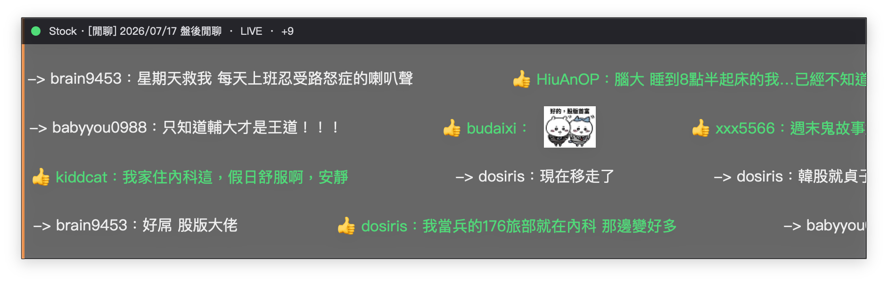

# PTT Stock 彈幕

即時顯示 PTT Stock 版「盤中 / 盤後」閒聊串推文的桌面彈幕（Python + PyQt6 + WebSocket）。



## 特色

- 純 `wss://ws.ptt.cc/bbs` 終端串流（不爬 web 版）
- 畫面驅動導航：登入 → Stock → 搜尋盤中/盤後 → 進文 → END 到底
- Live 刷新語意對齊 [PttChrome Live 文小幫手](https://github.com/iamchucky/PttChrome)（LEFT 回列表後重定位再進）
- 半寬置頂彈幕窗、可拖曳；推綠 / 噓紅 / `->` 白
- 推文圖片 URL → `[圖]` placeholder，下載快取到 `image/` 後動態替換
- 右鍵／左上把手選單：暫停、穿透、密度、退出

## 需求

- Python 3.9+
- macOS / Linux（Windows 可跑但字型與穿透行為可能不同）

## 安裝

```bash
python3 -m venv .venv
source .venv/bin/activate   # Windows: .venv\Scripts\activate
pip install -r requirements.txt
```

若 `uao` 安裝失敗可忽略（會 fallback 到 big5hkscs / big5）。

## 帳號設定

**不要把帳密寫進程式或提交到 git。**

```bash
cp .pttrc.example .pttrc
# 編輯 .pttrc
export PTT_ACCOUNT=你的帳號
export PTT_PASSWORD=你的密碼
chmod 600 .pttrc
```

或直接：

```bash
export PTT_ACCOUNT=你的帳號
export PTT_PASSWORD=你的密碼
```

可選環境變數：

| 變數 | 預設 | 說明 |
|------|------|------|
| `PTT_KICK_OTHER` | `1` | 偵測到重複登入時是否踢掉其他連線（`0`/`n` 則送 n） |

## 執行

```bash
source .pttrc
python3 ptt_danmaku.py
```

啟動後會：

1. 連線 WebSocket 並登入
2. 進入 Stock、搜尋盤中/盤後閒聊並進入
3. 推文輸出到 console（`[PUSH]`）並飛上彈幕

關閉視窗或選單「退出」結束程式。

### 操作

| 操作 | 說明 |
|------|------|
| 拖曳視窗 | 左鍵按住拖動（預設關閉穿透） |
| 左上把手 | 拖曳／開選單 |
| 右鍵選單 | 暫停、滑鼠穿透、密度（疏/中/密）、退出 |

### 除錯工具

```bash
python3 test_ws.py
# 或指定文章
python3 test_ws.py "https://www.ptt.cc/bbs/Stock/M.xxxx.A.xxx.html"
```

## 注意

- 需要有效 PTT 帳密；guest 導航成功率低
- 預設重複登入會踢掉其他連線（`PTT_KICK_OTHER=0` 可改為保留）
- WS 連線可能中斷，程式會自動重試
- Live 刷新間隔約 5–10 秒隨機（LEFT 回列表再進），請勿改成過短以免增加 PTT 負擔
- 推文圖片僅允許常見圖床 host，且有大小/並發上限
- 圖片快取目錄 `image/` 為執行期產物，已在 `.gitignore`
- 請遵守 PTT 站規，勿高頻洗連線
- **切勿**把 `.pttrc`、帳號密碼 commit 到 git 或貼給陌生人

## 給 AI 的協助提示（可整段複製）

若你要請 ChatGPT / Claude / Cursor / Grok 等幫忙安裝、除錯或改功能，可把下面整段貼給 AI 當 system / 首則說明：

```text
你是熟悉 macOS/Linux 終端與 Python 的助理。請根據下列專案說明，協助使用者安裝、執行或除錯「PTT Stock 彈幕」。

## 專案是什麼
- GitHub：https://github.com/AlanChiou/PttStockLive
- 語言：Python 3.9+，GUI：PyQt6，連線：websocket-client → wss://ws.ptt.cc/bbs
- 用途：登入 PTT → 進入 Stock 板 → 自動找「盤中/盤後」閒聊串 → 把推/噓/→ 顯示成桌面彈幕
- 主程式：ptt_danmaku.py；除錯：test_ws.py；相依：requirements.txt
- 授權：Apache-2.0

## 正確安裝與執行（請依序指導使用者）
1. git clone https://github.com/AlanChiou/PttStockLive.git && cd PttStockLive
2. python3 -m venv .venv && source .venv/bin/activate
3. pip install -r requirements.txt
   - uao 裝失敗可忽略（會 fallback big5）
4. cp .pttrc.example .pttrc，編輯填入：
   export PTT_ACCOUNT=使用者自己的PTT帳號
   export PTT_PASSWORD=使用者自己的密碼
5. source .pttrc && python3 ptt_danmaku.py
6. 關閉彈幕視窗或選單「退出」應結束行程；console 會有 [INFO]/[STATE]/[ACTION]/[PUSH]

## 行為與操作（協助解釋 UI）
- 彈幕窗：半寬、可拖曳；推=綠+👍、噓=紅+👎、→=白+->；字型 PingFang TC 16pt
- 圖片 URL 會先變 [圖]，下載到 ./image/ 快取後嵌入；GIF 在彈幕飛行期間 loop
- 選單：暫停、滑鼠穿透、密度疏/中/密、退出；左上小把手可拖/開選單
- Live 刷新：約每 5–10 秒隨機 LEFT 回列表再重進文（降低固定節奏壓站）
- 導航是「看當下終端畫面」決定按鍵，不是靠一堆長期 flag

## 常見問題排查
- 沒帳密 / 密碼錯：無法穩定導航
- 卡在登入、任意鍵、看板封面：看 [STATE]/[ACTION]，常是 anykey 要 SPACE
- 找到列表但沒進文：搜尋結果標題可能被截斷，程式應認 [閒聊]+日期 與 ● 游標後 RIGHT
- 彈幕沒推文：可能還不在目標文、或文末未 END；看是否 [CHECK] 目標文章確認 / LIVE
- 點其他視窗彈幕消失：應為置頂窗；若仍 hide 再查 window flags
- 關不掉 python：退出須 app.quit()；Tool 窗在 macOS 曾有失焦 hide 問題（已改）
- 絕對不要把使用者的 .pttrc 或密碼寫進 repo、gist、或公開對話

## 你協助時的原則
- 優先給可直接複製的指令；標明 macOS / Linux 差異
- 改 code 前先說明會動哪些檔、為何
- 不要建議爬 PTT web 版洗版或縮短刷新到 1 秒內
- 不要要求使用者貼出完整密碼；除錯時用「是否已 source .pttrc」即可
- 若使用者要改功能，先對齊現有架構（TerminalBuffer 畫面、detect_screen、彈幕 DanmakuOverlay）

請先確認使用者的 OS 與 Python 版本，再從「能否 source .pttrc 並啟動」一步步協助。
```

## 授權

[Apache License 2.0](LICENSE)
